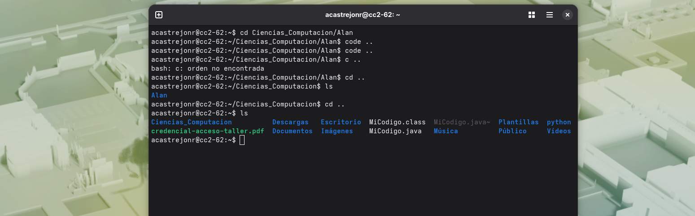

La adaptación, ha sido bastante buena,  no he tenido nungún tipo de problema; no así el ritmo, ya que considero que los laboratorios de ICC han sido muy rápido. Creo que si no hubiese aprendido a programar, no entendería nada.

